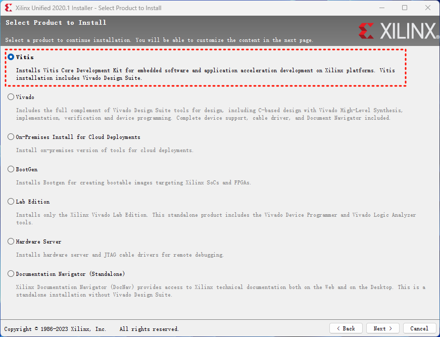
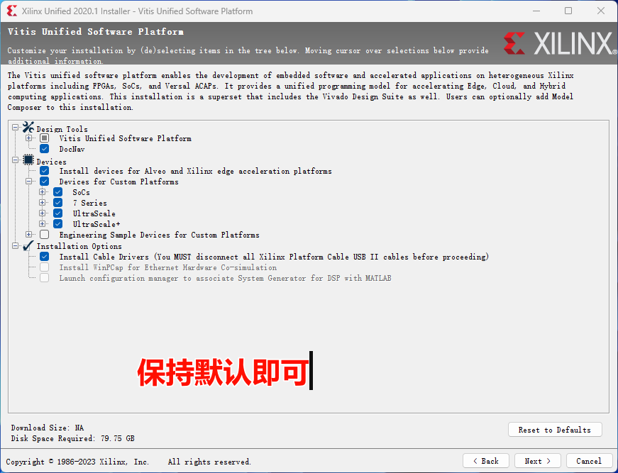
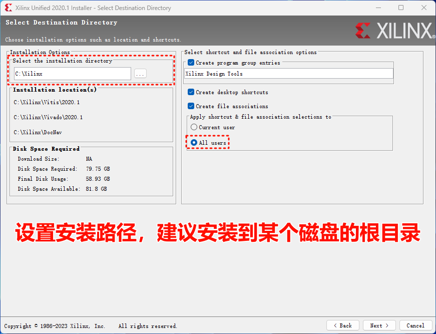

# 安装开发环境

## 1. 系统和软件要求

**操作系统**：Windows 10/11

软件清单，见下表：

|软件名称|说明|
|---|---|
|MATLAB 2021a|需要安装Vivado补丁|
|HDL Coder Support Package for Xilinx Zynq Platform|硬件支持包|
|HDL Coder Support Package for Xilinx FPGA Boards|硬件支持包|
|Embedded Coder Support Package for Xilinx Zynq Platform|硬件支持包|
|Embedded Coder Support Package for ARM Cortex-A Processors|硬件支持包|
|Xilinx Unified 2020.1 (Vitis和Vivado)|编译平台代码生成固件|
|VS2017|用于代码生成|

### 1.1 安装MATLAB 2021a和相关补丁
在安装好MATLAB 2021a后，安装用于Vivado的补丁。[点击此处](https://ww2.mathworks.cn/support/bugreports/2656440)获取更详细内容。

WARNING: 不安装该补丁会导致无法正常生成用于FPGA的IP CORE

1. [点击](https://ww2.mathworks.cn/support/bugreports/2656440)进入页面（可能需要注册登录）下载补丁附件`attachment_2656440_2022-01-07.zip`。
2. 下载后解压，可以看到里面包含了用于不同MATLAB版本补丁。
3. 在解压后文件夹中，打开名为`R2021a`的文件夹，将里面的文件`IPEmitterVivado.p`覆盖`<MATLAB>\toolbox\hdlcoder\hdlcommon\+hdlturnkey\+ip\IPEmitterVivado.p`（提前对被覆盖文件做好备份）。`<MATLAB>`表示MATLAB 2021a的安装根目录。

### 1.2 安装硬件支持包

1. 将下载好的支持包复制到下载目录下面：路径示例`C:\Users\<username>\Downloads\MathWorks\SupportPackages\R2021a`。<username\>表示你的电脑用户名
2. 到MATLAB安装路径`<MATLAB>\bin\win64`下双击运行`SupportSoftwareInstaller.exe`。
3. 接下来按照提示操作即可。

!!! NOTE 
	- Embedded Coder Support Package for Xilinx Zynq Platform（似乎非必要，和下面支持包的二选一即可，保险起见全部安装）
	- Embedded Coder Support Package for ARM Cortex-A Processors（目的是其包含的工具链Linaro Toolchain v4.8）

!!! NOTE "详细操作细节可以参考下面视频"
	

### 1.3 安装Xilinx Unified 2020.1

[点此查看下载页面](https://china.xilinx.com/support/download/index.html/content/xilinx/zh/downloadNav/vitis/archive-vitis.html)。下载连接为：[https://china.xilinx.com/member/forms/download/xef.html?filename=Xilinx_Unified_2020.1_0602_1208.tar.gz](https://china.xilinx.com/member/forms/download/xef.html?filename=Xilinx_Unified_2020.1_0602_1208.tar.gz)（需要注册登录账号）

将下载的软件包解压并运行安装程序。下面介绍几个关键选项

??? TIP "1. 选择Vitis"
	

??? TIP "2. 保持默认安装选项即可"
	

??? TIP "3. 设置安装路径。可以选择为所有用户安装。"
	

后续按照安装指引操作即可。

### 1.4 安装VS2017

该版本不是唯一。可以安装其他VS版本。但是不建议安装最新版本。目前MALAB采用2021a，因此推荐采用早于2021年发布的VS版本。
[下载页面](https://github.com/RflyBUAA/RflySimRTDoc/tree/gh-pages/software)

