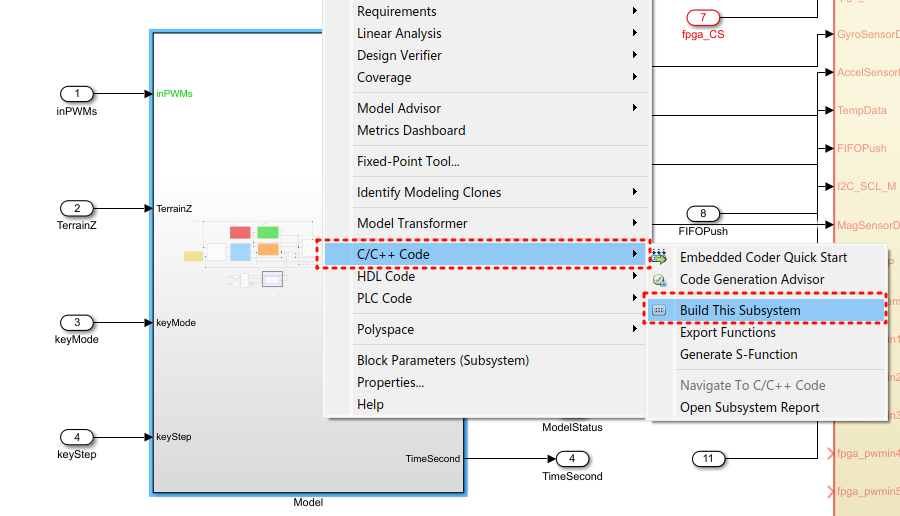
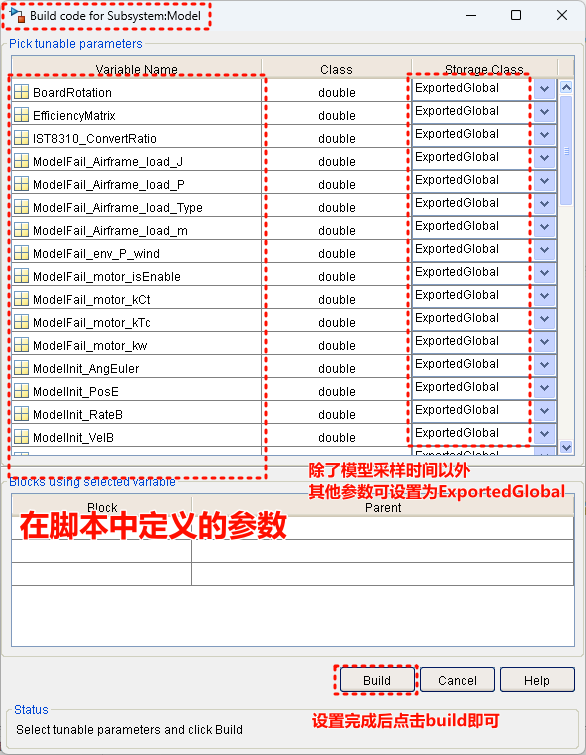
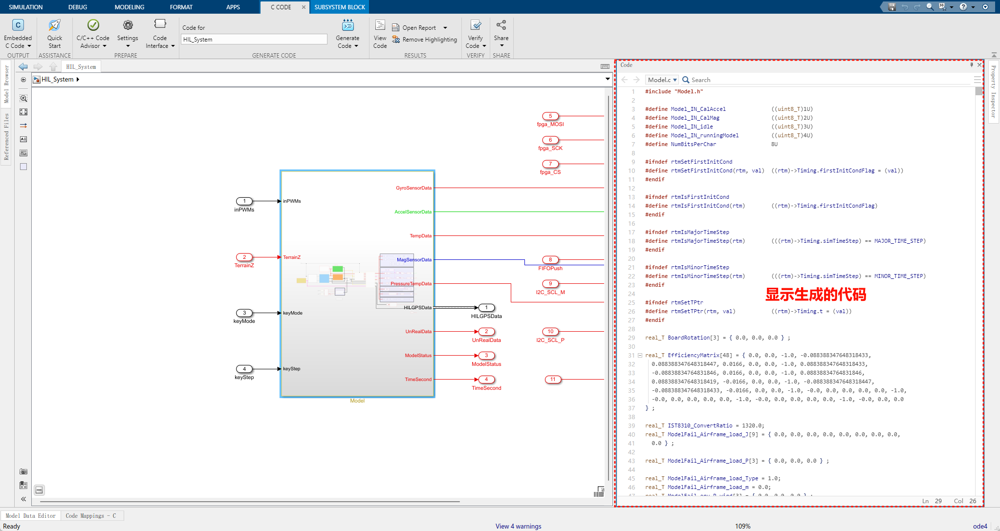
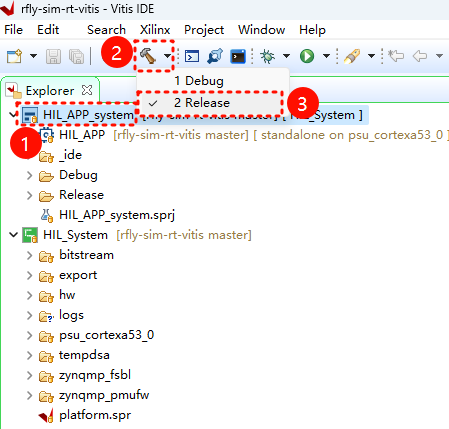
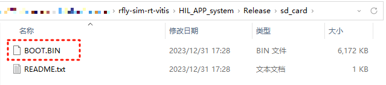

# 生成仿真模型


## 1. 预备操作

用MATLAB 2021a打开工程文件，该文件位于[PL文件夹中](../dev_manual/envConfig.md#3)，名为`PL.prj`。

打开工程中的文件`.\Tools\CopyModelCode2VitisPrj.m`，该文件用于自动将生成的模型代码拷贝到vitis工程路径中，免去手动繁琐的操作。文件中
```
vitisPrjPath = 'D:\myWorkSpace\RflySimCourse\socfpga-hil-vitis\';
unzip('code\Model.zip','Tools\Model')
delete .\Tools\Model\code\Model_ert_rtw\ert_main.c  .\Tools\Model\code\Model_ert_rtw\buildInfo.mat  .\Tools\Model\code\Model_ert_rtw\defines.txt
copyfile('.\Tools\Model',[vitisPrjPath,'HIL_APP\src\TaskINT\Model'])
rmdir Tools\Model s
```
修改`vitisPrjPath`的值为用户在[导入Vitis工程源码](../dev_manual/envConfig.md#2-vitis)中设置的路径。

<br/>
## 2. 生成模型代码

设置安装路径（修改下面命令的路径为Xilinx软件的安装路径）
```
hdlsetuptoolpath('ToolName','Xilinx Vivado','ToolPath','D:\Xilinx\Vivado\2020.1\bin\vivado.bat');  
```

依次运行脚本

- PL\Model\H250DegradedParamInit4S.m
- PL\HIL_System\SensorParamInit.m

打开模型文件

- PL\HIL_System\HIL_System.slx

在模型最顶层找到model子系统，在子系统上右键，编译子系统，关键步骤如下所示

??? TIP "第一步：启动模型编译"
	

??? TIP "第二步：选择需要暴露的参数"
	设置需要可调的参数。注意不要将模型采样时间设置为可调（保持为Inlined），这样会导致错误。
	

??? TIP "第三步：查看生成的代码"
	编译后会显示生成的代码，可以在右侧查看到
	

最后运行脚本

- PL\Tools\CopyModelCode2VitisPrj.m

此时，生成的模型文件已经更新到了Vitis工程中。请用户在HIL_System.slx框架内自定义自己的模型，但不要对模型的输入输出接口做任何更改，也不要修改模型代码生成的相关配置，否则可能导致后续源码编译失败或者工作异常。

## 3. 生成仿真器启动文件

打开Vitis 2020.1，选择在[导入Vitis工程源码](../dev_manual/envConfig.md#2-vitis)中导入的工作空间。

!!! NOTE 
	第一次导入后，下次打开默认显示上次打开的工作空间。

如下图所示，选中顶层工程HIL_APP_system，再选择Release模式，将开始编译

编译后按照下图路径找到编译出的文件BOOT.BIN。

将图中BOOT.BIN文件复制到仿真器的SD卡中，不要修改文件名称。