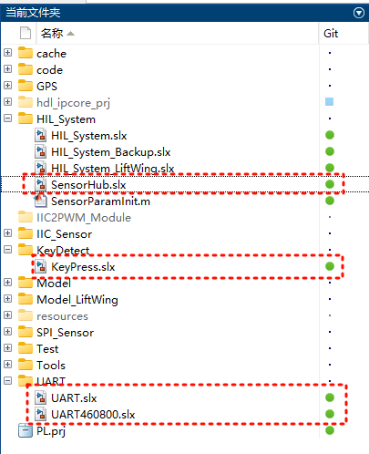
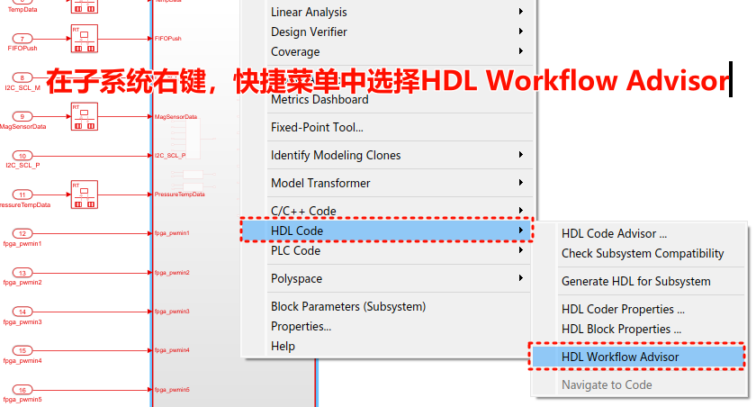
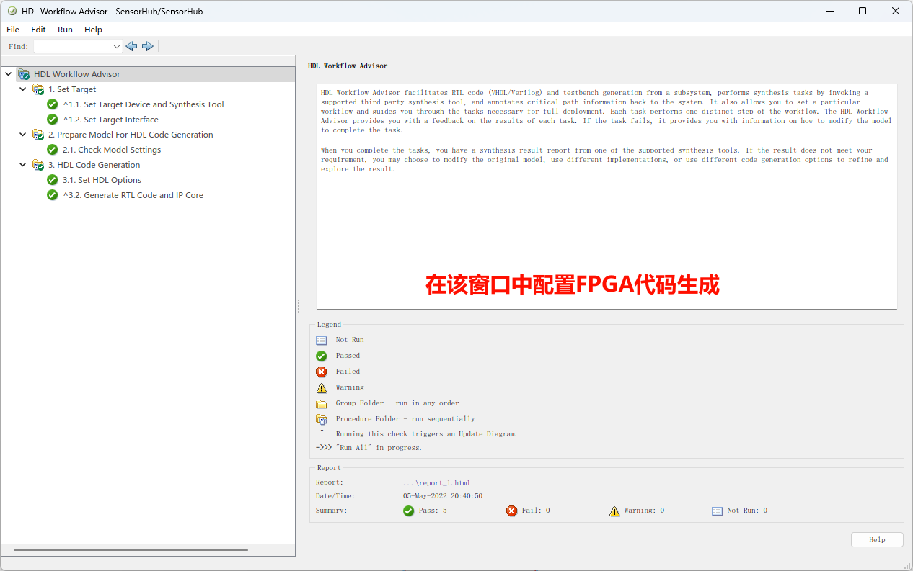
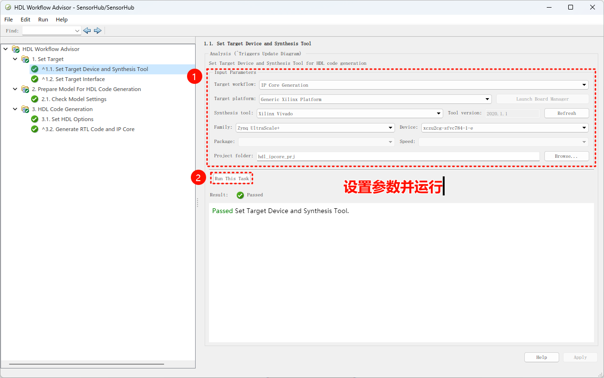
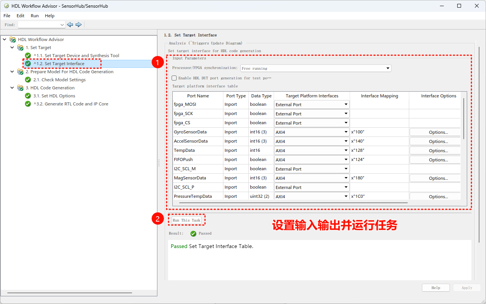
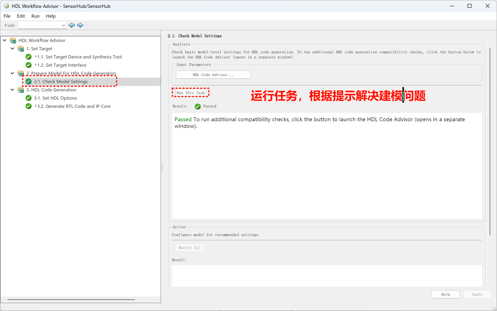
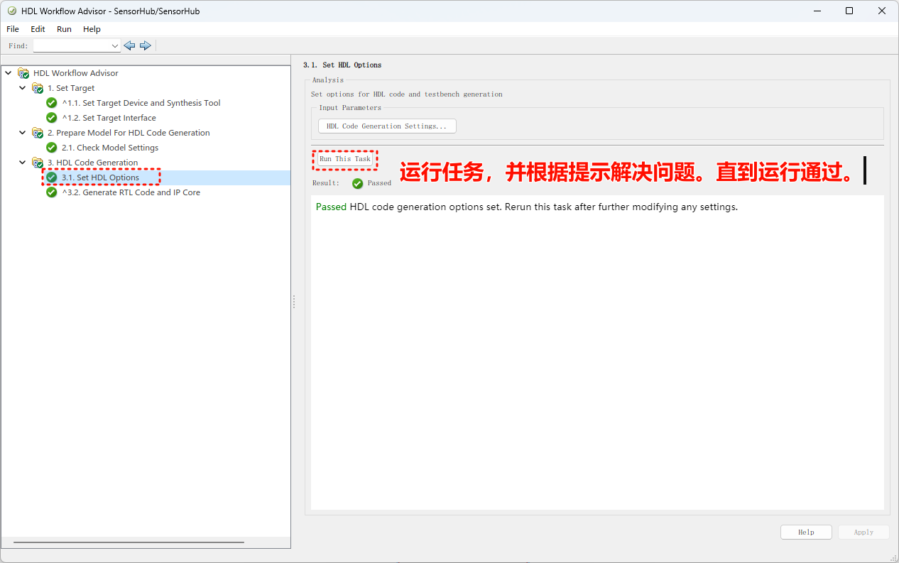
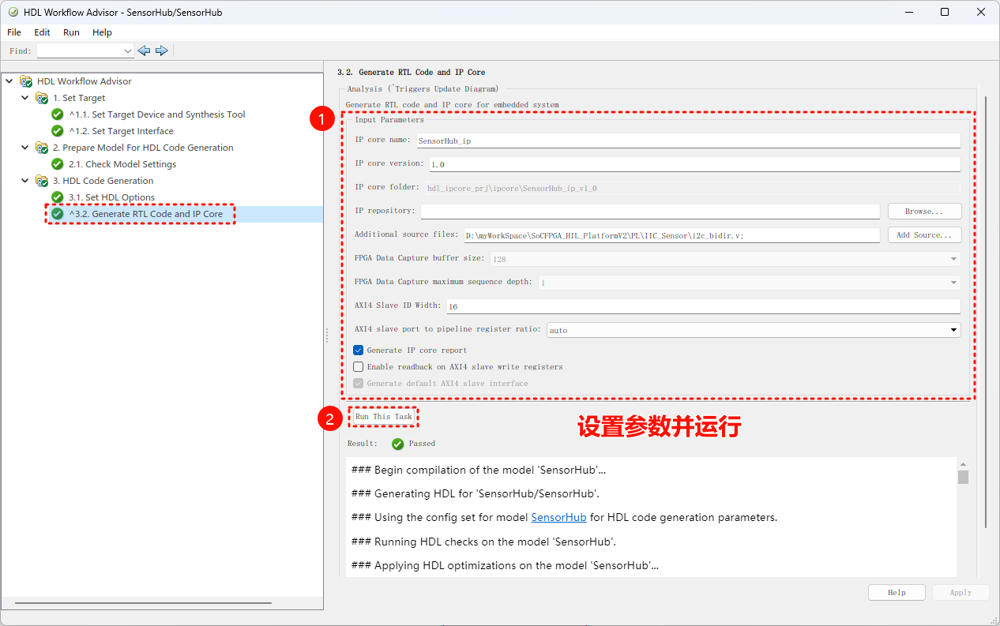
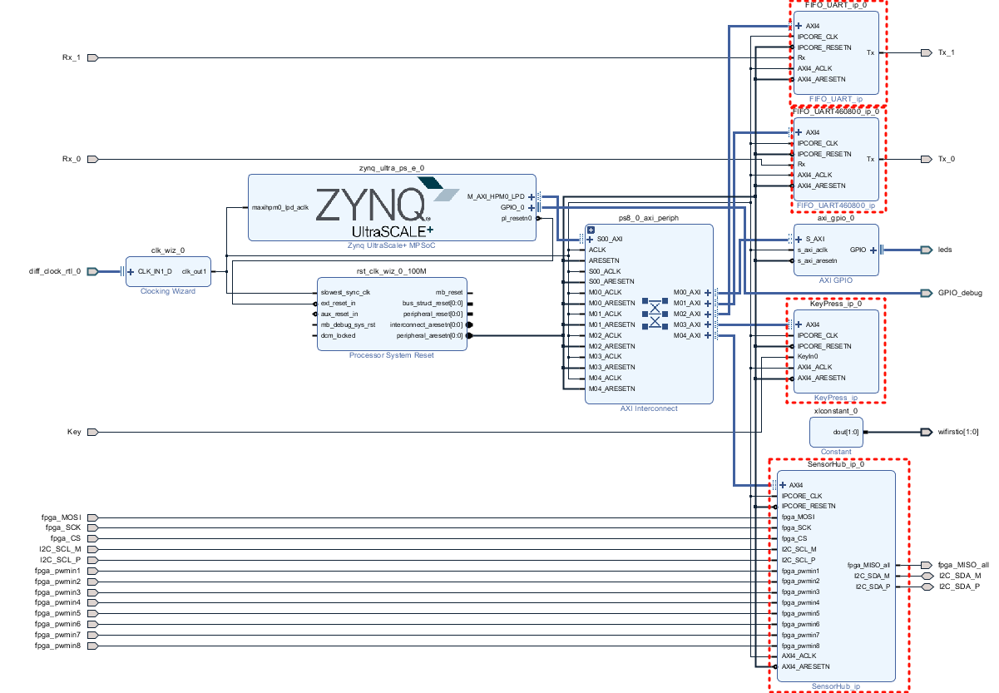

# 生成FPGA平台文件

这部分内容涉及的主要软件包括：MATLAB、Vivado。具体的关系为MATLAB/Simulink生成FPGA逻辑代码以IP Core的形式增加到vivado工程中，再由vivado工程编译并输出xsa文件。

## 1. MATLAB更新FPGA代码

下图所示的四个模型文件用于生成FPGA IP Core的源码，这里以SensorHub.slx文件举例。

在模型子系统上右键，打开对话窗口

之后根据提示，选择Yes或者No，之后稍等片刻即可得到下图所示的对话框

按照下图所示参数进行设置，并在每一步设置好后点击Run This Task，检查运行结果，如果有问题需要根据提示解决，然后再次运行，直到显示Passed。每一步都需要运行。下面几幅图给出了这些步骤的配置。

前面四个slx模型文件生成的IP Core对应下图中标记处的模块。下图是FPGA逻辑的顶层框图（后文中还会再次提到）。

## 2. Vivado编译生成.xsa文件
打开vivado打开FPGA工程

找到工程启动文件

如下图操作，可以看到FPGA即PL端的顶层逻辑

综合

综合完成后，可根据提示进入下一步。或者手动选择下一步。如图

完成后，取消

生成bit流文件

!!! NOTE "在执行步骤的等待过程中可以按照下图操作查看进度"
	

!!! TIP "生成导出.xsa文件"
	

	

	

	
