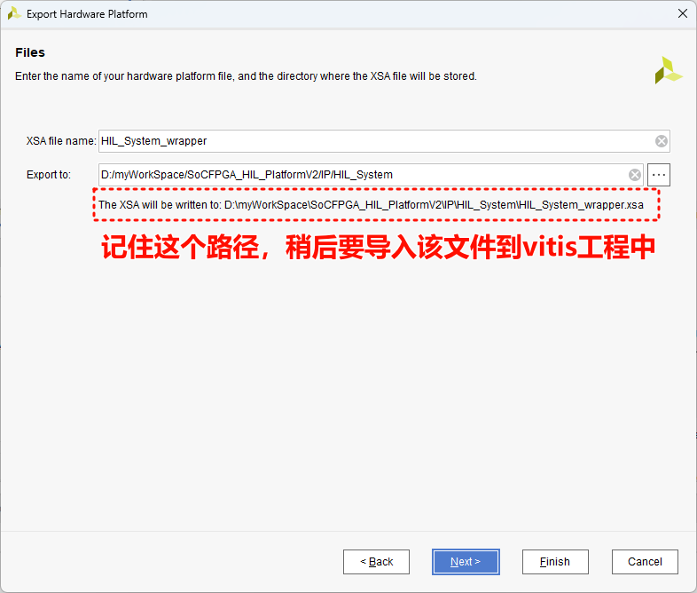

# 生成FPGA平台文件

## 1. MATLAB更新FPGA代码

## 2. Vivado编译生成xsa文件
打开vivado打开FPGA工程

找到工程启动文件

如下图操作，可以看到FPGA即PL端的顶层逻辑

综合

综合完成后，可根据提示进入下一步。或者手动选择下一步。如图

完成后，取消

生成bit流文件

!!! NOTE "在执行步骤的等待过程中可以按照下图操作查看进度"
	

!!! TIP "生成导出.xsa文件"
	

	

	

	
