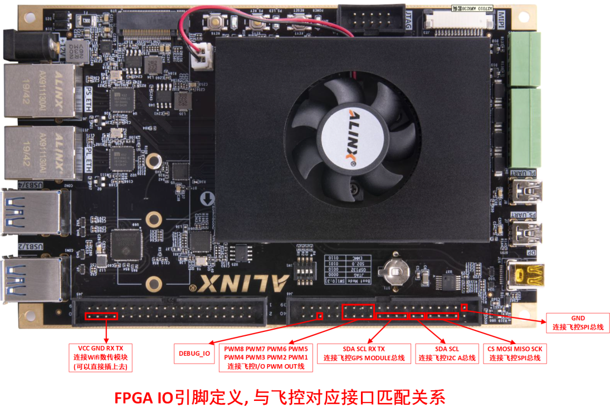
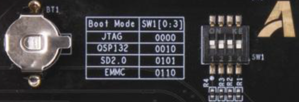
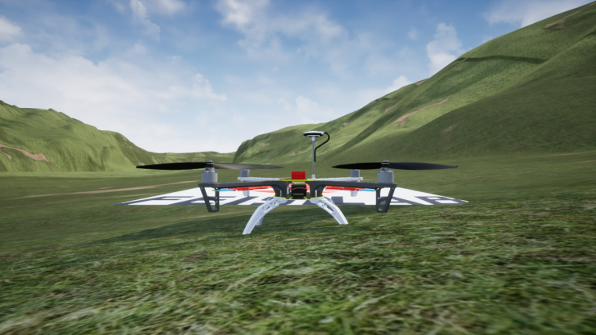
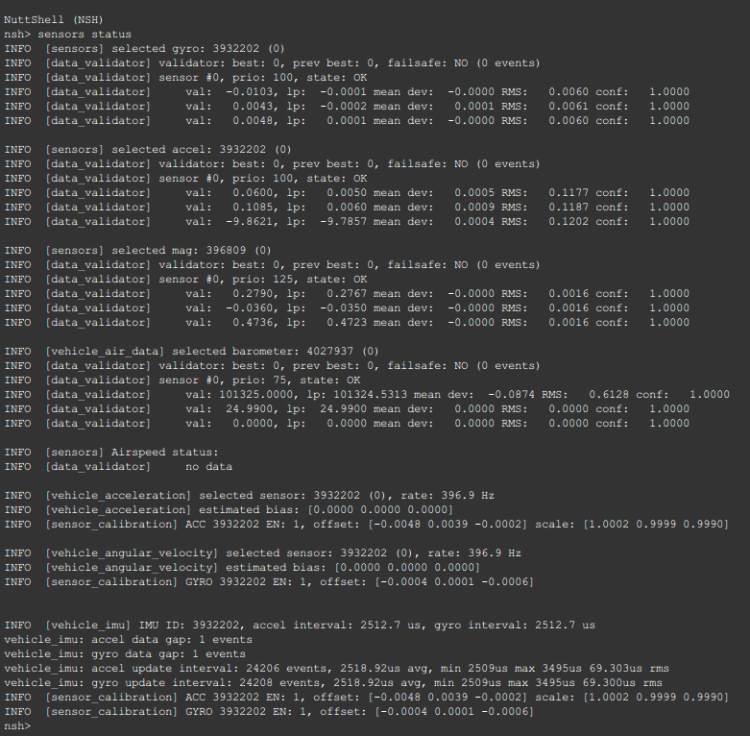

# 快速开始

首先介绍硬件连接，读者请按照文档指引完成硬件连接。之后介绍软件配置，读者可据此实现第一次运行。

## 1. 硬件连接

### 1.1 关键硬件清单

- 仿真器：ALINX MPSoC开发板，开发板型号AXU2CG-E，主控芯片型号XCZU2CG-SFVC784-1-E
- 自动驾驶仪：Pixhawk 4
- 连接线：GH1.25转杜邦连接线
- 通信模块：[正点原子串口转wifi模块](https://detail.tmall.com/item.htm?spm=a230r.1.14.18.69a09754bcIZd5&id=609757779633&ns=1&abbucket=8&skuId=4447338308660)

NOTE: Pixhawk 4 目前已经停售，可以替换为具有外置SPI接口的兼容PX4的自动驾驶仪。Pixhawk 6系列没有提供外置SPI接口。

### 1.2 硬件接口定义图

将飞控与开发板对应引脚使用GH1.25杜邦线对应连接在一起, 引脚定义查看下面几副图.  

**Pixhawk 4 接口定义图**

NOTE: 每个接口的左数第一个引脚是PIN 1, 也就是VCC


I2C A接口定义

|Pin|Signal|Volt|
|---|---|---|
|1(red)   |	VCC	|	+5V		|
|2(black) |	SCL4|	+3.3V	|
|3(black) |	SDA4|	+3.3V	|
|4(black) |	GND	|	+3.3V	|

Pixhawk GPS接口定义

|Pin|Signal|Volt|
|---|---|---|
|1(red)   |	VCC		|	+5V		|
|2(black) |	TX4(out)|	+3.3V	|
|3(black) |	RX4(in)	|	+3.3V	|
|4(black) |	SCL1	|	+3.3V	|
|5(black) |	SDA1	|	+3.3V	|

Pixhawk SPI接口定义

|Pin|Signal|Volt|
|---|---|---|
|1(red)   |	VCC	|	+5V		|
|2(black) |	SCK	|	+3.3V	|
|3(black) |	MISO|	+3.3V	|
|4(black) |	MOSI|	+3.3V	|
|5(black) |	CS1	|	+3.3V	|
|6(black) |	CS2	|	+3.3V	|
|7(black) |	GND	|	GND		|

Pixhawk I/O PWM OUT同FMU PWM OUT接口定义

|Pin|Signal|Volt|
|---|---|---|
|1(red)   	|	VDD_SERVO		|			|
|2(black) 	|	IO_CH1\FMU_CH1	|	+3.3V	|
|3(black) 	|	IO_CH2\FMU_CH2	|	+3.3V	|
|4(black) 	|	IO_CH3\FMU_CH3	|	+3.3V	|
|5(black) 	|	IO_CH4\FMU_CH4	|	+3.3V	|
|6(black) 	|	IO_CH5\FMU_CH5	|	+3.3V	|
|7(black) 	|	IO_CH6\FMU_CH6	|	+3.3V	|
|8(black) 	|	IO_CH7\FMU_CH7	|	+3.3V	|
|9(black) 	|	IO_CH8\FMU_CH8	|	+3.3V	|
|10(black)	|	GND				|	GND		|

NOTE: 以上给出了所用到的接口定义。更详细的接口定义可以参考
[Pixhawk4-Pinouts.pdf](https://www.yuque.com/attachments/yuque/0/2021/pdf/1166025/1627387378406-23e412b3-557b-4c01-bcb7-93daf58663f1.pdf)

**开发板IO接口定义图, 管脚和红框中的定义标记依次对应**



如上图（`图：开发板IO接口定义`）所示，将串口wifi模块安装到开发板左下角位置上。效果图如下


<!--  -->

### 1.3 其他连接

1.将开发板的PS串口通过数据线与电脑USB接口连接

NOTE: 串口用于系统调试，建议使用[**MobaXterm**](https://mobaxterm.mobatek.net/)\
[Putty](https://www.chiark.greenend.org.uk/~sgtatham/putty/)\
[SecureCRT](https://www.vandyke.com/products/securecrt/index.html)\
[WindTerm](https://github.com/kingToolbox/WindTerm)
等的工具在电脑上打开串口连接，实现命令行功能。尽管其他的串口助手软件也可使用，但是无法实现命令行的交互效果。

2.连接开发板电源

NOTE: [可以购买带开关的DC电源线, 免去电源插拔的繁琐操作](https://item.taobao.com/item.htm?spm=a1z09.2.0.0.32f12e8dZlbJXh&id=599221327119&_u=rqvdro2801a)


## 2. 飞控固件设置
**RflySim-RT**借助FPGA模拟真实的传感器逻辑从而实现硬件在环仿真的目的。比较通用的做法是将原有传感器去除，并在原有焊接接口上飞线并与仿真平台连接。好在，Pixhawk 4上提供了外置的SPI和I2C接口，可以借助这些接口直接与仿真器连接。因此，需要让飞控默认使用外置SPI和I2C接口，与仿真器进行通信。
这里采用修改PX4启动脚本的方式让自动驾驶仪在启动的时候优先尝试连接外部SPI的IMU，从而实现一次烧录，既能用于仿真也能用于实飞的目的。这里修改**飞控的传感器启动脚本进行简单修改重新编译烧录到飞控中**。

NOTE: 默认支持PX4 v1.11版本的固件。对于v1.12的支持请参考[适配PX4 1.12固件](../user_manual/configforPX41_12.md)。区别主要在于启动脚本的修改内容有细微的变化。 

这里假设用户使用RflySim进行控制算法的开发。为了能够与RflySim-RT实现仿真，需要修改固件源码的启动脚本。对于Pixhawk 4飞控而言，启动脚本路径位于**X:\PX4PSP\Firmware\boards\px4\fmu-v5\init\rc.board_sensors**。
其他类型的飞控可在路径 **\Firmware\boards** 中查找。`X`是RflySim的安装盘符，默认是C盘。

NOTE: 如果使用官方原生固件，也需要到对应的目录`Firmware\boards\px4\fmu-v5\init\`下修改rc.board_sensors文件，需要修改内容也是一样的。建议使用vscode之类的编辑软件。因为回车符的区别，不建议使用Windows系统的记事本。

使用编辑器打开rc.board_sensors。修改为如下内容
```
#!/bin/sh
#
# PX4 FMUv5 specific board sensors init
#------------------------------------------------------------------------------

adc start
if ! icm20689 -S start
then
# Internal SPI bus ICM-20602
#icm20602 -s -R 2 start

# Internal SPI bus ICM-20689
icm20689 -s -R 2 start

# Internal SPI bus BMI055 accel/gyro
#bmi055 -A -R 2 -s start
#bmi055 -G -R 2 -s start

# internal compass
#ist8310 -I start
fi

if ! ms5611 -X start
then
# Baro on internal SPI
ms5611 -s start
fi
#icm20689 -S start
#ms5611 -X start
```

修改后的脚本逻辑是优先启动外置传感器，如果启动失败则会启动内置传感器，这样相同的固件可以不经修改既可以运行在本仿真平台上，也可以实飞。当然了，还是建议仿真一个飞控，实飞一个飞控。

WARNING: 
- 请再次确认飞控中安装的PX4飞控固件版本是1.11.3版本。<br/> 

- 且飞控的模式是四旋翼。<br/>


## 3. 固件参数设置

成功运行仿真系统只需要修改以下参数为指定值，见下图


## 4. 开发板固件安装
开发板采用SD启动方式。操作步骤如下:

1.从开发板上取下SD卡，使用读卡器将固件复制到SD卡根目录上。
固件下载链接：[https://bhpan.buaa.edu.cn:443/link/1FF3201F500F3D00A9C483235A36B653](https://bhpan.buaa.edu.cn:443/link/1FF3201F500F3D00A9C483235A36B653)有效期限：2023-09-01 23:59

!!! WARNING
	- SD卡需要提前格式化为FAT32格式。
	- 固件的名字必须是BOOT.bin。

2.通过拨码开关，设置开发板的上电启动模式为SD卡模式。拨码开关设置参考下图，应设置为0101，对应到图中从左到右是**上下上下**。



3.将SD卡插回到开发板上。

---

完成以上设置后，给开发板通电，并且连接USB到电脑，可以在设备管理器中看到（**确认已经安装CP210X的驱动**），使用串口终端连接串口。


这里使用MobaXterm举例打开串口，波特率设置为115200，打开后在串口终端里输入**help**并且**回车**。见下图：


当然也可以先连接串口再打开开发板，或者按下开发板的复位键，应该能看到更多启动信息。见下图：


如果连接了串口转wifi模块，打开RflySim3D软件应该可以看到一架四旋翼飞行器出现在窗口中（如果没有显示，请先检查wifi模块是否正常连接到局域网中）




## 5. 飞控上电

连接飞控与电脑（确保已经按照前面步骤重刷修改过启动脚本的固件），打开QGC可以看到地面站连接到飞控. 在地面站的控制台中输入`sensors status` 回车，可以看到飞控读取到的传感器信息。


如果配置过程没问题得话，可以获得传感器状态信息如下图。这些传感器数据实际上是FPGA模拟出来的，飞控却会认为这是真实的传感器。



!!! info inline end "如果没有出现以上效果请再次确认"
	- 飞控的Px4 版本是1.11.3。
	- 且飞行模式是四旋翼模式。
	- 确认飞控和开发板物理接线正确。 
	- 检查地线是否正确连接。
