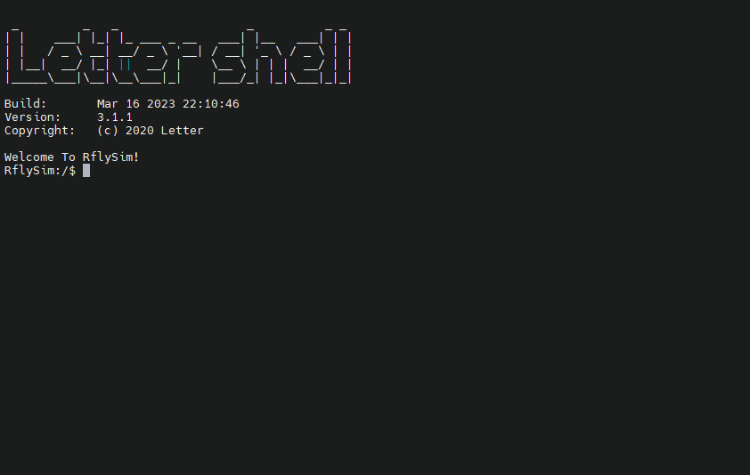

# 修改模型参数


RflySim-RT在运行过程中，可通过串口终端对仿真模型的参数进行修改。具体来讲，则是使用param命令。

## 简介

在串口终端输入指令
```
param
```
可以看到param相关的功能。

<br/>
下表简单汇总了param命令的使用方法

|命令|说明|
|---|---|
|param list									|列出可修改的参数													|
|param listfile								|列出根目录下的文件													|
|param save									|保存当前参数到默认参数文件中										|
|param save <filename\>						|保存当前参数到指定参数文件中，并且将该<br/>文件设置为默认参数文件		|
|param load									|加载默认参数文件													|
|param load <filename\>						|加载指定参数文件													|
|param set <index\> <value\>					|修改模型参数值														|
|param set <index\> <value_index\> <value\>	|修改模型参数值，参数为矩阵时按列排布															|
|param set <filename\>						|设置指定文件为默认参数文件，如果该文件<br/>不存在，系统重启时将按照参数默认值创建<br/>该文件。	|

 <!--    param list          列出可修改的参数
    param listfile     列出根目录下的文件
    param save       保存当前参数到默认参数文件中
    param save [filename]  保存当前参数到指定参数文件中, 并且将该文件设置为默认参数文件
    param load        加载默认参数文件
    param load [filename]        加载指定参数文件
    param set [index] [value]        修改模型参数值
    param set [index] [value_index] [value] column major 修改模型参数值, 针对数组
    param set [filename]  设置指定文件为默认参数文件, 如果设置的文件不存在, 下次系统重启会自动新建文件 -->

下面对param命令进行具体说明。
## 命令说明

??? NOTE "param list"
	列出所有可修改的变量，效果如下
	```
	RflySim:/$ param list
	FrameConfigPath is: H250.json
	SensorConfigPath is: SensorConfig.json
	EnvConfigPath is: EnvConfig.json
	[0]Mass is:  0.752000
	[1]C_md is:  0.000100  0.000100  0.000060
	[2]J is:
		0.005600  0.000000  0.000000
		0.000000  0.005600  0.000000
		0.000000  0.000000  0.010400
	[3]motorCr is:  0.000000
	[4]motorFitType is:  2.000000
	[5]motorJm is:  8.849300
	[6]motorMinThr is:  0.148000
	[7]motorRateCurveCoeffi is:  -2143.000000  5113.000000  -458.400000
	[8]motorTc is:  0.032000
	[9]motorWb is:  0.000000
	[10]rotorCt is:  1.345000
	[11]NoiseVarAcc0 is:  0.000100  0.000100  0.001000
	[12]NoiseVarGyro0 is:  0.000050  0.000050  0.000050
	[13]NoiseVarMag0 is:  0.000002  0.000002  0.000002
	[14]PositionAcc0 is:  0.000000  0.000000  0.000000
	[15]DisplayUAVType is:  3.000000
	[16]CopterID is:  6031.000000
	[17]RotorDirection is:  1.000000  1.000000  -1.000000  -1.000000  0.000000  0.000000  0.000000  0.000000
	[18]EfficiencyMatrix is:
		0.000000  0.000000  0.000000  0.000000  0.000000  0.000000  0.000000  0.000000
		0.000000  0.000000  0.000000  0.000000  0.000000  0.000000  0.000000  0.000000
		-1.000000  -1.000000  -1.000000  -1.000000  -1.000000  -1.000000  -1.000000  -1.000000
		-0.088400  0.088400  0.088400  -0.088400  -0.000000  -0.000000  -0.000000  -0.000000
		0.088400  -0.088400  0.088400  -0.088400  0.000000  0.000000  0.000000  0.000000
		0.016600  0.016600  -0.016600  -0.016600  0.000000  0.000000  0.000000  0.000000
	[19]BoardRotation is:  0.000000  0.000000  45.000000
	[20]IST8310_ConvertRatio is:  1320.000000
	[21]Using_OneShot is:  1.000000
	```
	上面输出
	```
	FrameConfigPath is: H250.json
	```
	表明当前默认的参数文件是`H250.json`

??? NOTE "param listfile"
	列出SD卡根目录下所有文件
	```
	RflySim:/$ param listfile
	: System Volume Information
	: Config.txt
	: MainConfig.json
	: FrameConfig.json
	: BOOT.BIN
	: H250.json
	: F450.json
	: F550.json
	: octo.json
	: backup
	: modulocto.json
	no more file
	```
	其中**MainConfig.json**文件是配置的指向文件，后续介绍的设置默认参数配置文件的功能就是通过修改这个文件中的指向来实现的。这些文件存放于SD卡中，读者可自行验证。

??? NOTE "param save"
	保存内存中的参数到默认的参数文件中，要查看当前默认的参数文件名，可以使用param list函数查看。如果保存成功，会有提示，如下所示。
	```
	RflySim:/$ param save
	File <H250.json> Save Successfully.
	```

??? NOTE "param save <filename\>"
	保存参数到指定参数文件中，文件不存在则创建，且会将新指定的文件设置为默认参数文件。

	- <filename\>：目标参数文件。注意包含文件后缀`.json`。

	使用效果如下
	```
	RflySim:/$ param save H250.json
	File <H250.json> Save Successfully.
	File <H250.json> is updated to FrameConfigPath Successfully.
	```
	成功保存后，指令会自动将新保存的文件设置为默认的参数文件。

??? NOTE "param load"
	加载默认参数文件。使用效果如下
	```
	RflySim:/$ param load
	File <H250.json> Load Successfully.
	```

??? NOTE "param load <filename\>"
	加载指定参数文件。

	- <filename\>：目标参数文件。注意包含文件后缀`.json`。

	使用效果如下
	```
	RflySim:/$ param load H250.json
	File <H250.json> Load Successfully.
	File <H250.json> is updated to FrameConfigPath Successfully.
	```

??? NOTE "param set <index\>  <value\>"
	修改指定参数在内存中的数值，适用于标量参数。重启后会恢复为默认参数文件中的参数值。如要长期保存参数，请再使用param save命令或者param save <filename\>
	
	- <index\>：参数序号，也就是param list运行结果中的参数编号；
	- <value\>：要设置的数值。

??? NOTE "param set <index\>  <value_index\>  <value\>" 
	功能上与param set <index\> <value\>相同。适用于向量和数组参数。

	- <index\>：参数序号，也就是param list中的参数前的编号
	- <value_index\>：参数序号。特别的对于矩阵而言，value_index为列优先。例如对于3x3的矩阵参数，value_index的有效取值范围是0-8。具体序号如下
	0    3    6
	1    4    7
	2    5    8
	其他数组则按照从左到右的顺序并且从0开始。
	- <value\>：表示要设置的数值。

	```
	param set 2 3 1
	```
	上面的例子是将编号为**2**的参数中的编号为**3**的元素设置为**1**

??? NOTE "param set <filename\>"

	- <filename\>：目标参数文件。注意包含文件后缀`.json`。
	设置默认参数文件。若文件不存在，依旧能够设置成功，且在重启后自动创建所指定的参数文件。
