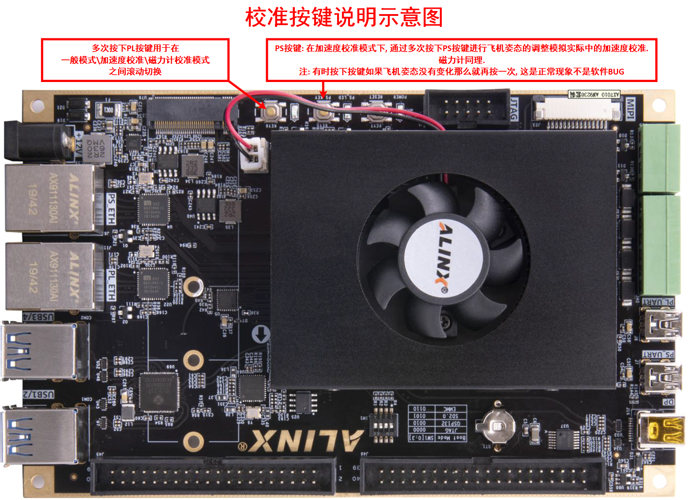

# 传感器校准

用户应该首先熟悉安装有PX4固件的飞控（自动驾驶仪）正常的校准操作方法。本平台则是通过仿真器上的两个按钮来模拟实际中对飞控进行校准的物理操作，如对飞控的旋转。这两个按钮的具体作用在下图中给出。

上图中有两个按键。这里分别用左键和右键来描述。

!!! TIP "左键" 
	模式切换，仿真器上电运行后为**一般模式**，之后通过该按键对模式进行循环切换，分别为**一般模式**、**加速度校准模式**、**磁力计校准模式**。陀螺仪校准只需要保持飞行器静止即可。

!!! TIP "右键"
	- 进入加速度模式后，通过该按键可逐次转换飞行器的姿态。加速度校准需要将飞行器依次保持在六种姿态下维持一定时间完成校准。用户需要根据QGC地面站的提示，单击按键完成飞行器的姿态转换，从而完成校准步骤。在校准过程中用户可以在RflySim3D中看到飞行器的姿态变化。
	- 进图磁力计校准模式后，通过该按键可逐次转换飞行器的姿态，并按照QGC地面站磁力计校准的提示，继续单机按键模拟飞行器的转动完成校准过程。